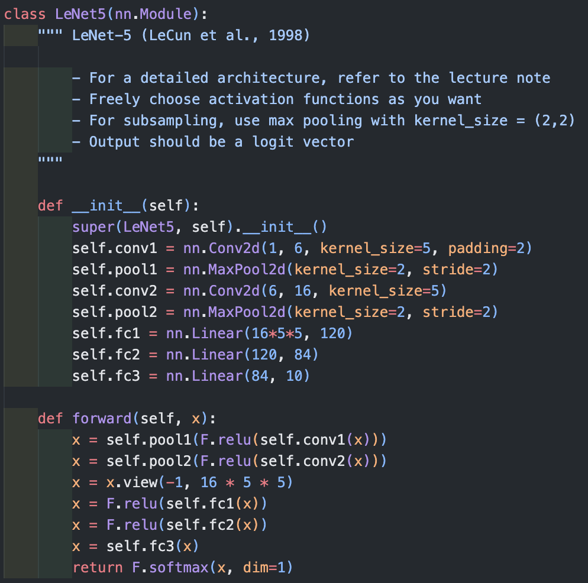
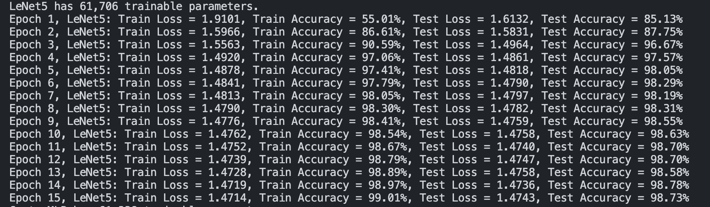
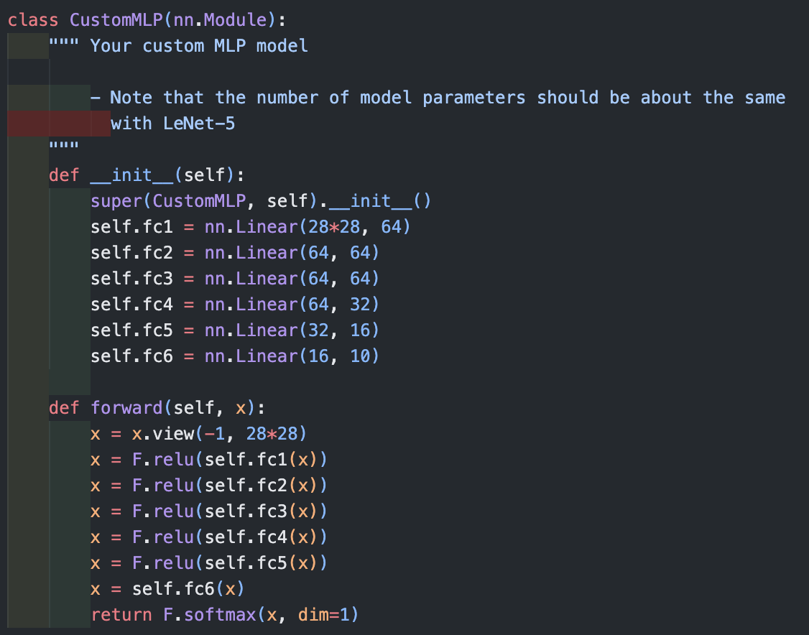
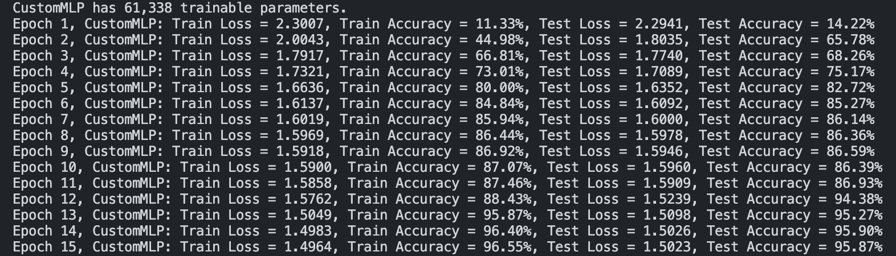
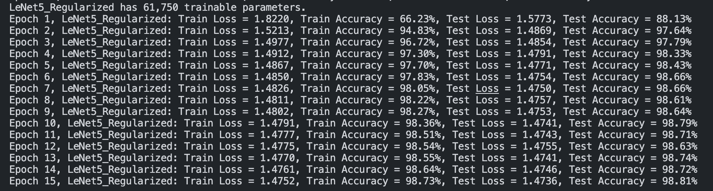
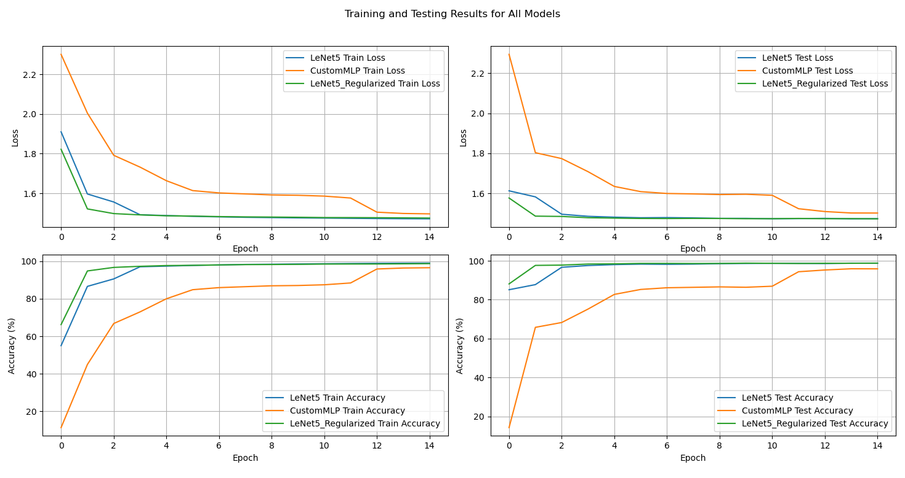

# MNIST_Classification
인공신경망과 딥러닝 

Assignment #2

24510101 김상훈 

shkim@ds.seoultech.ac.kr

# Abstract

This project designs and implements two neural network models, LeNet-5 and Custom MLP, for the MNIST classification. Both models were designed to have a similar number of parameters. **The LeNet-5 model achieved a classification accuracy exceeding 98%, as typically expected.** In contrast, the Custom MLP model recorded an accuracy of 95%. **Batch normalization and Dropout techniques** were applied to LeNet-5 to enhance its generalization performance.

# Report

## Lenet-5 
### LeNet-5 Model Architecture

The LeNet-5 model consists of convolutional layers followed by fully connected layers, each designed for image classification tasks. Below are the details regarding the architecture and the calculation of parameters for each layer:

#### First Convolutional Layer (`conv1`):
- **Input Channels:** 1 (grayscale image)
- **Output Channels:** 6
- **Kernel Size:** 5x5
- **Padding:** 2
- **Parameters:** Calculation of weights and biases:
  - **Weights:** 5 * 5 * 1 * 6 = 150
  - **Biases:** 6
  - **Total for conv1:** 150 + 6 = 156

#### First Pooling Layer (`pool1`):
- **Type:** Max Pooling
- **Kernel Size:** 2x2
- **Stride:** 2
- **Parameters:** 0 (pooling layers do not have trainable parameters)

#### Second Convolutional Layer (`conv2`):
- **Input Channels:** 6
- **Output Channels:** 16
- **Kernel Size:** 5x5
- **Parameters:** Calculation of weights and biases:
  - **Weights:** 5 * 5 * 6 * 16 = 2,400
  - **Biases:** 16
  - **Total for conv2:** 2,400 + 16 = 2,416

#### Second Pooling Layer (`pool2`):
- **Type:** Max Pooling
- **Kernel Size:** 2x2
- **Stride:** 2
- **Parameters:** 0

#### First Fully Connected Layer (`fc1`):
- **Input Features:** 16 * 5 * 5 = 400
- **Output Features:** 120
- **Parameters:** Calculation of weights and biases:
  - **Weights:** 400 * 120 = 48,000
  - **Biases:** 120
  - **Total for fc1:** 48,000 + 120 = 48,120

#### Second Fully Connected Layer (`fc2`):
- **Input Features:** 120
- **Output Features:** 84
- **Parameters:** Calculation of weights and biases:
  - **Weights:** 120 * 84 = 10,080
  - **Biases:** 84
  - **Total for fc2:** 10,080 + 84 = 10,164

#### Third Fully Connected Layer (`fc3`):
- **Input Features:** 84
- **Output Features:** 10
- **Parameters:** Calculation of weights and biases:
  - **Weights:** 84 * 10 = 840
  - **Biases:** 10
  - **Total for fc3:** 840 + 10 = 850

### Total Parameters Calculation
Adding all the parameters from each layer:

- **Total Parameters for LeNet-5:** 156 + 2,416 + 48,120 + 10,164 + 850 = 61,706

### Result

The models were trained for 15 epochs using the described structures, and the following results were obtained.

## Custom MLP

### Custom MLP Model Architecture

The Custom MLP model consists of several fully connected layers, as described:

#### First Fully Connected Layer (`fc1`):
- **Input Features:** 784 (flattened 28x28 image)
- **Output Features:** 64
- **Parameters:** Calculation of weights and biases:
  - **Weights:** 784 * 64 = 50,176
  - **Biases:** 64
  - **Total for fc1:** 50,176 + 64 = 50,240

#### Second Fully Connected Layer (`fc2`):
- **Input Features:** 64
- **Output Features:** 64
- **Parameters:** Calculation of weights and biases:
  - **Weights:** 64 * 64 = 4,096
  - **Biases:** 64
  - **Total for fc2:** 4,096 + 64 = 4,160

#### Third Fully Connected Layer (`fc3`):
- **Input Features:** 64
- **Output Features:** 64
- **Parameters:** Same as fc2
  - **Total for fc3:** 4,160

#### Fourth Fully Connected Layer (`fc4`):
- **Input Features:** 64
- **Output Features:** 32
- **Parameters:**
  - **Weights:** 64 * 32 = 2,048
  - **Biases:** 32
  - **Total for fc4:** 2,048 + 32 = 2,080

#### Fifth Fully Connected Layer (`fc5`):
- **Input Features:** 32
- **Output Features:** 16
- **Parameters:**
  - **Weights:** 32 * 16 = 512
  - **Biases:** 16
  - **Total for fc5:** 512 + 16 = 528

#### Sixth Fully Connected Layer (`fc6`):
- **Input Features:** 16
- **Output Features:** 10
- **Parameters:**
  - **Weights:** 16 * 10 = 160
  - **Biases:** 10
  - **Total for fc6:** 160 + 10 = 170

### Total Parameters Calculation
Adding all the parameters from each layer:

- **Total Parameters for Custom MLP:** 50,240 + 4,160 + 4,160 + 2,080 + 528 + 170 = 61,338

### Result

The models were trained for 15 epochs using the described structures, and the following results were obtained.

## Lenet-5_Regularized

### Regularization Techniques in the LeNet5_Regularized Model

The `LeNet5_Regularized` model employs two regularization techniques, including Batch Normalization and Dropout, to enhance robustness and generalization. Below is an overview of where and how these techniques are implemented:

#### Batch Normalization

Batch Normalization is applied to standardize the inputs to each layer within the network. By normalizing the input layer activations, Batch Normalization stabilizes the learning process and significantly reduces the number of training epochs required to converge.

- **First Convolutional Layer (`conv1`):**
  - **Structure:** `nn.Conv2d(1, 6, 5, padding=2), nn.BatchNorm2d(6)`
  - **Details:** After applying a 5x5 convolutional filter with padding, Batch Normalization is applied to the 6 feature maps output by the convolution. This helps in normalizing the outputs, accelerating the training, and enabling higher learning rates.

- **Second Convolutional Layer (`conv2`):**
  - **Structure:** `nn.Conv2d(6, 16, 5), nn.BatchNorm2d(16)`
  - **Details:** Similar to the first layer, after the convolution that increases the depth from 6 to 16, Batch Normalization is used to normalize the outputs of the convolutional layer. This reduces internal covariate shift and improves the training dynamics.

#### Dropout

Dropout is a regularization method that randomly sets a fraction of input units to 0 at each update during training time, which helps prevent overfitting. The dropout rate specified in this model is 0.2 (20%).

- **First Fully Connected Layer (`fc1`):**
  - **Structure:** `nn.Linear(16 * 5 * 5, 120), nn.Dropout(0.2)`
  - **Details:** After mapping the flattened feature maps to 120 outputs, Dropout is applied. This discourages complex co-adaptations on training data.

- **Second Fully Connected Layer (`fc2`):**
  - **Structure:** `nn.Dropout(0.2), nn.Linear(120, 84)`
  - **Details:** Dropout is applied right before the linear transformation to 84 units. This positioning ensures that the network retains robustness to input noise and variance.

- **Third Fully Connected Layer (`fc3`):**
  - **Structure:** `nn.Dropout(0.2), nn.Linear(84, 10)`
  - **Details:** Similar to `fc2`, Dropout precedes the final classification layer, which maps the 84 inputs to 10 output classes. This helps in mitigating overfitting even at the final stage of decision-making.

### Result

**Despite a lower Train Accuracy of 98.73%** (vs 99.01%), the application of two regularization techniques resulted in **a higher Test Accuracy of 98.81%** (vs 98.73%).

## Results with Plots

The results, plotted across epochs, show the training and testing loss and accuracy for three models. **Overall performance ranks  in the following order: LeNet-5_Regularized, LeNet-5, and Custom MLP**. Notably, **the LeNet-5_Regularized model**, which includes batch normalization and dropout, **not only learns faster but also achieves better performance** compared to LeNet-5.
